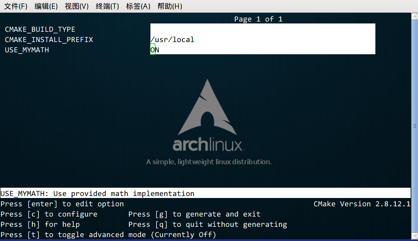

# Demo04-自定义编译选项（option关键字的使用）

**小结**：通过对本节内容的学习：

1）可以理解CMake中`option`关键字和C++代码中宏定义的关系；

2）可以学会通过`ccmake`命令可视化CMake编译选项，并进行编译选项的选择。

CMake 允许为项目增加编译选项，从而可以根据用户的环境和需求选择最合适的编译方案。

例如，可以将 MathFunctions 库设为一个可选的库，如果该选项为 `ON` ，就使用该库定义的数学函数来进行运算。否则就调用标准库中的数学函数库。

#### 修改 CMakeLists 文件

我们要做的第一步是在顶层的 CMakeLists.txt 文件中添加该选项：

```cmake
# CMake 最低版本号要求
cmake_minimum_required (VERSION 2.8)

# 项目信息
project (Demo4)

# 加入一个配置头文件，用于处理 CMake 对源码的设置
configure_file (
  "${PROJECT_SOURCE_DIR}/config.h.in"
  "${PROJECT_BINARY_DIR}/config.h"
  )

# 是否使用自己的 MathFunctions 库
option (USE_MYMATH
       "Use provided math implementation" ON)

# 是否加入 MathFunctions 库
if (USE_MYMATH)
  include_directories ("${PROJECT_SOURCE_DIR}/math")
  add_subdirectory (math)  
  set (EXTRA_LIBS ${EXTRA_LIBS} MathFunctions)
endif (USE_MYMATH)

# 查找当前目录下的所有源文件
# 并将名称保存到 DIR_SRCS 变量
aux_source_directory(. DIR_SRCS)

# 指定生成目标
add_executable(Demo ${DIR_SRCS})
target_link_libraries (Demo  ${EXTRA_LIBS})
```

其中：

1. 第7行的 `configure_file` 命令用于加入一个配置头文件 config.h ，这个文件由 CMake 从config.h.in生成，通过这样的机制，将可以通过预定义一些参数和变量来控制代码的生成。
2. 第13行的 `option` 命令添加了一个 `USE_MYMATH` 选项，并且默认值为 `ON` 。
3. 第17行根据 `USE_MYMATH` 变量的值来决定是否使用我们自己编写的 MathFunctions 库。

#### 修改 main.cc文件

之后修改main.cc文件，让其根据 `USE_MYMATH` 的预定义值来决定是否调用标准库还是 MathFunctions 库：

```c++
#include <stdio.h>
#include <stdlib.h>
#include "config.h"

#ifdef USE_MYMATH
  #include "math/MathFunctions.h"
#else
  #include <math.h>
#endif


int main(int argc, char *argv[])
{
    if (argc < 3){
        printf("Usage: %s base exponent \n", argv[0]);
        return 1;
    }
    double base = atof(argv[1]);
    int exponent = atoi(argv[2]);
    
#ifdef USE_MYMATH
    printf("Now we use our own Math library. \n");
    double result = power(base, exponent);
#else
    printf("Now we use the standard library. \n");
    double result = pow(base, exponent);
#endif
    printf("%g ^ %d is %g\n", base, exponent, result);
    return 0;
}
```

#### 编写config.h.in文件

上面的程序值得注意的是第2行，这里引用了一个 config.h 文件，这个文件预定义了 `USE_MYMATH` 的值。但我们并不直接编写这个文件，为了方便从 CMakeLists.txt 中导入配置，我们编写一个config.h.in文件，内容如下：

```
#cmakedefine USE_MYMATH
```

这样 CMake 会自动根据 CMakeLists 配置文件中的设置自动生成 config.h 文件。

#### 编译项目

现在编译一下这个项目，为了便于交互式的选择该变量的值，可以使用 `ccmake` 命令，该命令会提供一个会话式的交互式配置界面）：

CMake的交互式配置界面

从中可以找到刚刚定义的 `USE_MYMATH` 选项，按键盘的方向键可以在不同的选项窗口间跳转，按下 `enter` 键可以修改该选项。修改完成后可以按下 `c` 选项完成配置，之后再按 `g` 键确认生成 Makefile 。ccmake 的其他操作可以参考窗口下方给出的指令提示。

我们可以试试分别将 `USE_MYMATH` 设为 `ON` 和 `OFF` 得到的结果：

##### USE_MYMATH 为 ON

运行结果：

```shell
[ehome@xman Demo4]$ ./Demo
Now we use our own MathFunctions library. 
 7 ^ 3 = 343.000000
 10 ^ 5 = 100000.000000
 2 ^ 10 = 1024.000000
```

此时 config.h 的内容为：

```shell
#define USE_MYMATH
```

##### USE_MYMATH 为 OFF

运行结果：

```shell
[ehome@xman Demo4]$ ./Demo
Now we use the standard library. 
 7 ^ 3 = 343.000000
 10 ^ 5 = 100000.000000
 2 ^ 10 = 1024.000000
```

此时 config.h 的内容为：

```c++
/* #undef USE_MYMATH */
```